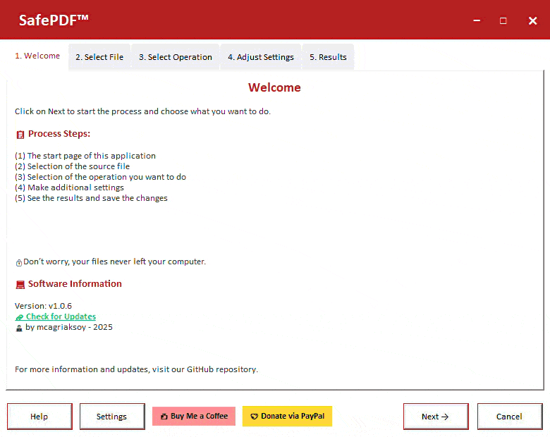

# SafePDF - Privacy-First PDF Toolkit

<p align="center"> 
   
</p>

[](https://github.com/mcagriaksoy/SafePDF/releases/)
[](#license)
[](https://github.com/mcagriaksoy/SafePDF)

**SafePDF** is a privacy-focused, offline PDF manipulation tool. All operations are performed locally on your device—your sensitive documents never leave your computer.

<a href="https://github.com/mcagriaksoy/SafePDF/releases/" download>
  
</a>

## Why SafePDF?

**100% Offline** - No cloud uploads, no internet required  
**Fast & Lightweight** - Operations run directly on your device  
**Privacy First** - Ideal for sensitive documents (legal, healthcare, financial)  
**Multi-language** - English, German, Turkish support

> **Read more:** [The Security Concerns of Online PDF Tools](https://medium.com/dev-genius/the-untold-security-concerns-of-online-pdf-editing-tools-6ee1d83facd6)


## Features

- **Compress** - Reduce PDF file size with quality control
- **Split** - Separate PDFs by pages or custom ranges
- **Merge** - Combine multiple PDF files into one
- **Convert to Images** - Export PDF pages as JPG/JPEG
- **Rotate** - Rotate pages (90°, 180°, 270°)
- **Repair** - Fix corrupted PDF files
- **Convert to Word** - Export PDF as DOCX documents
- **Extract Text** - Extract plain text from PDFs
- **Extract Info** - View PDF metadata and properties

**Interface Features:**
- Drag & drop file selection
- Real-time progress tracking
- Multi-language UI
- Modern, intuitive design




## Quick Start

### Option 1: Download Executable (Recommended)
1. Download the latest release from [Releases](https://github.com/mcagriaksoy/SafePDF/releases/)
2. Extract the ZIP file
3. Run `SafePDF.exe`

### Option 2: Run from Source

**Requirements:**
- Python 3.7+
- pip

**Installation:**
```bash
# Clone the repository
git clone https://github.com/mcagriaksoy/SafePDF.git
cd SafePDF

# Install dependencies
pip install -r requirements.txt

# Run the application
python run_safe_pdf.py
```

## How to Use

1. **Select Operation** - Choose what you want to do (compress, split, merge, etc.)
2. **Select File** - Drag & drop your PDF or click to browse
3. **Adjust Settings** - Configure operation-specific options
4. **Execute** - Click to process your file
5. **View Results** - See output and open the processed file

## Development

### Project Structure
```
SafePDF/
├── SafePDF/
│   ├── ctrl/           # Controllers
│   ├── ui/             # User interface
│   ├── ops/            # PDF operations
│   ├── logger/         # Logging
│   └── text/           # Localization files
├── run_safe_pdf.py     # Main launcher
└── requirements.txt    # Dependencies
```

### Contributing

Contributions are welcome! Please:
- Report bugs via [Issues](https://github.com/mcagriaksoy/SafePDF/issues)
- Submit pull requests for improvements
- Follow existing code style

## Support

- Email: [info@safepdf.de](mailto:info@safepdf.de)
- Report Issues: [GitHub Issues](https://github.com/mcagriaksoy/SafePDF/issues)
- Documentation: [safepdf.de](https://safepdf.de)

## License

Released under [GPL-3.0](/LICENSE) by [@mcagriaksoy](https://github.com/mcagriaksoy).

## Support the Project

<a href="https://www.buymeacoffee.com/mcagriaksoy">
  
</a>

---

Made for privacy-conscious users

