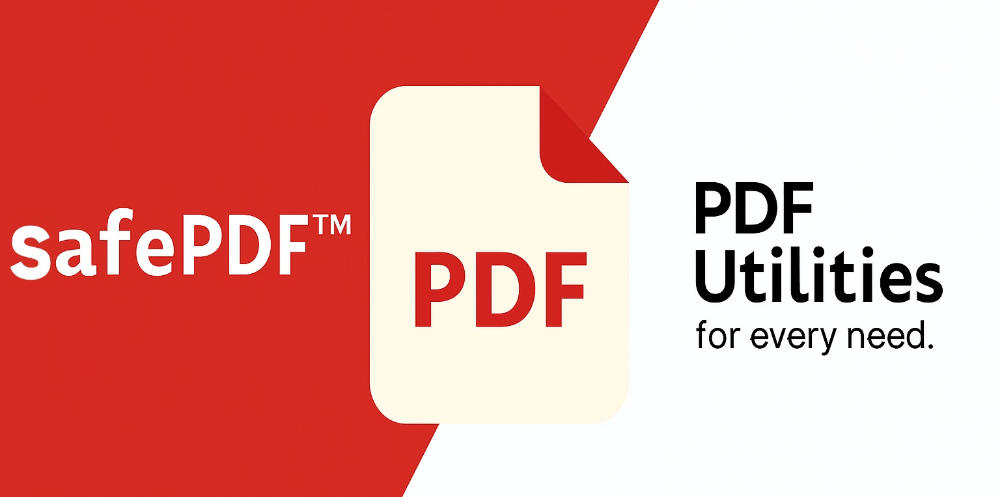
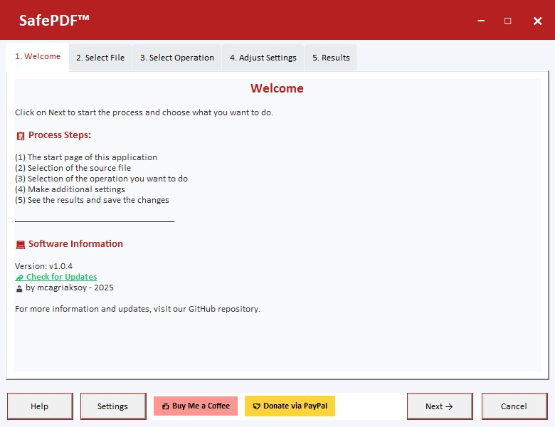

## Privacy-First PDF Toolkit
[](https://github.com/mcagriaksoy/SafePDF "Go to GitHub repo")
[](https://github.com/mcagriaksoy/SafePDF)
[](https://github.com/mcagriaksoy/SafePDF)
[](https://github.com/mcagriaksoy/SafePDF/releases/)
[](#license)
[](https://github.com/mcagriaksoy/SafePDF/issues)

SafePDF is a powerful, privacy-focused PDF manipulation tool designed to handle your documents entirely offline. Whether you're compressing large files, splitting pages, merging multiple PDFs, converting to images, rotating pages, or repairing corrupted documents SafePDF does it all locally, ensuring your sensitive data never leaves your device.



## Why SafePDF?

Unlike cloud-based tools, SafePDF performs all operations directly on your device, eliminating the risk of data exposure. It's ideal for professionals, legal teams, healthcare providers, and anyone who values document confidentiality.

Medium article: https://medium.com/dev-genius/the-untold-security-concerns-of-online-pdf-editing-tools-6ee1d83facd6


## Features

- **PDF Compression**: Reduce PDF file size with adjustable quality settings
- **PDF Split/Separate**: Split PDF into individual pages or custom page ranges
- **PDF Merge**: Combine multiple PDF files (coming soon)
- **PDF to JPG**: Convert PDF pages to high-quality JPG images
- **PDF Rotate**: Rotate PDF pages by 90°, 180°, or 270°
- **PDF Repair**: Attempt to repair corrupted PDF files
- **Drag & Drop**: Easy file selection with drag-and-drop support
- **Progress Tracking**: Real-time progress indication for operations
- **User-friendly Interface**: Intuitive tabbed interface similar to the Qt version




### How to use?


## Download URL
<a href="https://github.com/mcagriaksoy/SafePDF/releases/" download>
  
</a>

## Documentation

[](https://mcagriaksoy.github.io/SafePDF/)
[](/docs/ "Go to project documentation")

## License

Released under [GPL-3.0-1](/LICENSE) by [@mcagriaksoy](https://github.com/mcagriaksoy).

## Donation

<a href="https://www.buymeacoffee.com/mcagriaksoy"></a>

## Installation

You can use the executable directly or download the source-code and run given instructions.

### Prerequisites

- Python 3.7 or higher
- pip (Python package installer)
- PyPDF2>=3.0.0
- Pillow>=9.0.0
- PyMuPDF>=1.20.0
- tkinterdnd2>=0.3.0
- python-docx>=0.8.11
  
Note: If you encounter issues with `tkinterdnd2`, the application will still work without drag-and-drop functionality.

### Install Dependencies

```bash
pip install -r requirements.txt
```

## Usage

### Running the Application

You can use the executable or download the source-code and run below:

```bash
# Run the main application (from project root)
python run_safe_pdf.py

# Or run the main application directly (from SafePDF/ directory)
python safe_pdf_app.py

# Or run as a module (from project root)
python -m SafePDF.safe_pdf_app

# Or run the test/demo script
python test_demo.py

# Test dependencies only
python test_demo.py --test-only
```

### Using the Application

1. **Welcome Tab**: Overview of the application and process steps
2. **Select File Tab**: 
   - Drag and drop a PDF file onto the designated area, OR
   - Click "Load File from Disk" to browse for a PDF file
3. **Select Operation Tab**: Choose from available PDF operations:
   - PDF Compress
   - PDF Separate/Split  
   - PDF Merge
   - PDF to JPG
   - PDF Rotate
   - PDF Repair
4. **Adjust Settings Tab**: Configure operation-specific settings
5. **Results Tab**: View operation progress and results

### Operation Details

#### PDF Compression
- **Low Quality**: Maximum compression, smaller file size
- **Medium Quality**: Balanced compression and quality
- **High Quality**: Minimal compression, better quality

#### PDF Split
- **Split by Pages**: Creates individual PDF files for each page
- **Split by Range**: Specify custom page ranges (e.g., "1-5,7,10-12")

#### PDF Rotation
- Rotate all pages by 90°, 180°, or 270°

#### PDF to JPG
- Converts each PDF page to a high-resolution JPG image
- Default DPI: 200 (adjustable in code)

#### PDF Repair
- Attempts to recover readable pages from corrupted PDF files
- Uses relaxed parsing to handle damaged files

## File Structure

```
SafePDF/
├── run_safe_pdf.py      # Launcher script (run from project root)
├── SafePDF/             # Main package
│   ├── __init__.py      # Package initializer
│   ├── safe_pdf_app.py  # Main application file
│   ├── ctrl/
│   │   └── safe_pdf_controller.py
│   ├── ui/
│   │   ├── __init__.py
│   │   └── safe_pdf_ui.py
│   ├── logger/
│   │   └── logging_config.py
│   ├── ops/
│   │   └── pdf_operations.py
│   ├── test/
│   │   ├── test_demo.py
│   │   └── test_compression.py
│   ├── assets/
│   ├── text/
│   └── version.txt
├── requirements.txt     # Python dependencies
├── README.md           # This file
└── LICENSE
```

## Navigation Controls

- **Back/Next**: Navigate between tabs
- **Help**: View application help
- **Settings**: Application settings (coming soon)
- **Cancel**: Exit the application

## Error Handling

The application includes comprehensive error handling:
- Invalid PDF file detection
- Missing dependency warnings
- Operation failure notifications
- Progress tracking with error recovery

## Troubleshooting

### Common Issues

1. **"PyPDF2/pypdf not available"**
   ```bash
   pip install PyPDF2
   # or
   pip install pypdf
   ```

2. **"PIL/Pillow not installed"**
   ```bash
   pip install Pillow
   ```

3. **"PyMuPDF not available"**
   ```bash
   pip install PyMuPDF
   ```

4. **Drag and drop not working**
   ```bash
   pip install tkinterdnd2
   ```
   Note: If tkinterdnd2 installation fails, you can still use the file browser button.

### Performance Tips

- For large PDF files, operations may take some time
- The application shows progress indicators for long operations
- Operations run in separate threads to keep the UI responsive

## Development

### Code Structure

- `SafePDFApp`: Main application class handling UI and user interactions
- `PDFOperations`: Backend class with all PDF manipulation logic
- Modular design allows easy addition of new operations

### Adding New Operations

1. Add operation logic to `PDFOperations` class
2. Create settings UI in `SafePDFApp.update_settings_for_operation()`
3. Add operation button in `create_operation_tab()`
4. Handle operation execution in `_run_operation_thread()`

## Contributing

Feel free to contribute by:
- Reporting bugs
- Suggesting new features
- Submitting pull requests
- Improving documentation
- Easy to modify and extend

For more information, visit: https://github.com/mcagriaksoy/SafePDF

